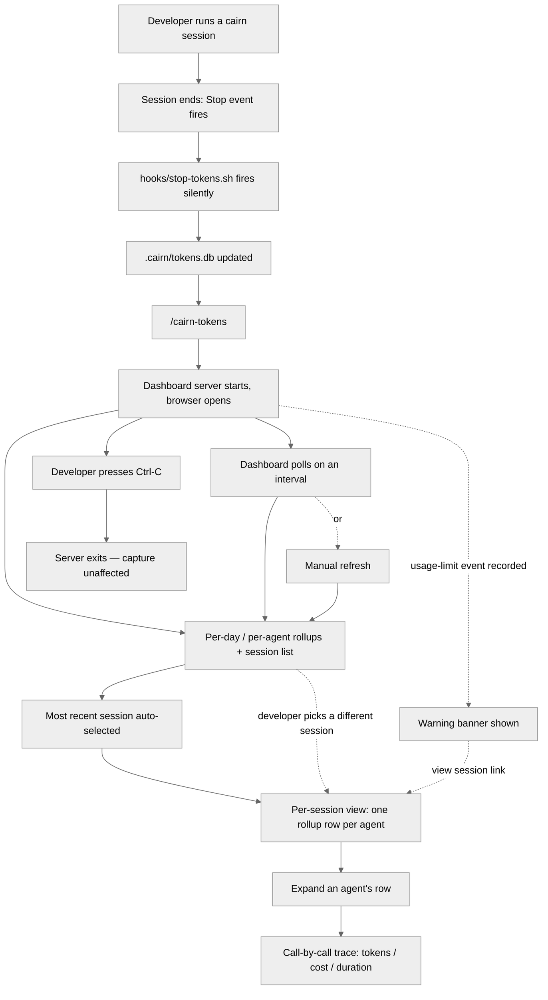

# User flow: token metering & dashboard (Phase 2)

Companion to `02-requirements.md` (what/why) and `03-architecture.md` (how). This traces what a developer actually does and sees, end to end.

## Diagram

## Flow 1: Passive capture (no user action)

1. Developer runs a normal cairn session — asks for a feature, cairn dispatches `planner`/`builder`/`reviewer`/`scribe` as needed.
2. Session ends (`Stop` event fires).
3. `hooks/stop-tokens.sh` fires silently; if the project has opted into cairn (its `CLAUDE.md` carries the marker) and `jq`/`python3` are available, it parses the just-ended session's transcript and writes to `.cairn/tokens.db`.
4. Nothing is shown to the developer — capture is fully silent, per §B10's "hooks nudge, they never gate."

## Flow 2: Opening the dashboard

1. Developer runs `/cairn-tokens`.
2. Cairn starts `token-metering/server.py` in the background and opens the default browser to the dashboard.
3. Terminal reports the URL and that Ctrl-C in that terminal stops it.
4. Dashboard loads, showing per-day and per-agent rollup bars (informational — not clickable, not a filter) across all captured sessions, a session list, and the most recent session's per-session view already open below it. No click is required to see a first example.
5. **Resolved** — cold start: if `/cairn-tokens` runs before any session has completed a `Stop` event, `.cairn/tokens.db` is empty or missing. The dashboard still starts and loads normally, showing an empty-state message (e.g. "No sessions captured yet — run a cairn session, then refresh") in place of the rollup bars and session list, rather than erroring or refusing to start.

## Flow 3: Changing which session is shown

1. Developer selects a different session from the session list, or follows the "view session" link from a usage-limit warning banner.
2. The per-session view updates: one rollup row per agent dispatched during that session (`main`, `planner`, `builder`, `reviewer`, `scribe`, `unknown`).
3. Developer expands an agent's rollup row (all start collapsed — no agent is auto-expanded).
4. Row expands into that agent's call-by-call trace, in order, each entry showing tokens, cost, and duration.

## Flow 4: Usage-limit warning

1. During a captured session, the developer hit a usage/rate limit (a synthetic `isApiErrorMessage: true` entry was recorded).
2. Next time the developer opens the dashboard for a period covering that session, a visible warning banner appears.
3. Developer traces the banner to the session/day it occurred and adjusts their workflow accordingly (e.g. reconsider the default/escalated budget, split work across sessions).

## Flow 5: Data refresh while the dashboard is open

1. Developer leaves the dashboard open in a browser tab while working in another cairn session.
2. The dashboard polls the server on an interval and updates rollups automatically.
3. Developer can also trigger a manual refresh for an immediate check without waiting for the next poll.

## Flow 6: Stopping the dashboard

1. Developer returns to the terminal that ran `/cairn-tokens`.
2. Presses Ctrl-C.
3. The server process exits; no background daemon remains. Capture (the `Stop` hook) is unaffected — it doesn't depend on the dashboard being open.
